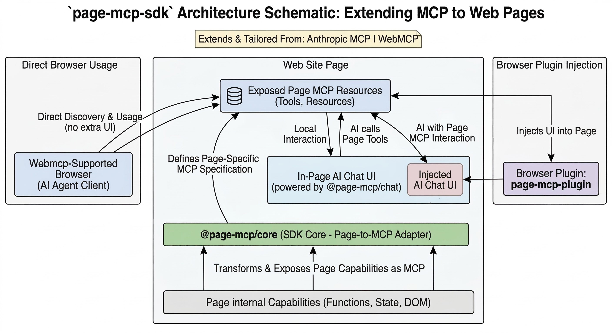

<p align="center">
  
</p>

<h1 align="center">Page MCP — AI Assistant</h1>

<p align="center">
  A browser extension that discovers <a href="https://modelcontextprotocol.io">MCP</a> capabilities exposed by web pages, enabling AI to accurately read page resources and perform page interactions.
</p>

<p align="center">
  <a href="./README.zh-CN.md">中文文档</a> · English
</p>

---

## What is Page MCP?

**Page MCP** is a Chrome extension built for the **Page MCP** ecosystem. It discovers and connects to [Model Context Protocol (MCP)](https://modelcontextprotocol.io) services exposed by web pages — built on top of the **Anthropic MCP** standard and **WebMCP** extensions — and uses them to power rich AI interactions directly within the browser.

<p align="center">
  
</p>

### Core Capabilities

| Capability | Description |
|---|---|
| 🔍 **MCP Auto-Discovery** | Automatically detects `PageMcpHost` instances embedded in web pages via the `@page-mcp/core` library |
| 🛠 **Tool Invocation** | Calls MCP tools exposed by the page (e.g. form submission, data queries, UI actions) on behalf of the AI |
| 📄 **Resource Reading** | Reads page-provided MCP resources (structured data, documents, context) for the AI to consume |
| 💬 **Prompt Shortcuts** | Surfaces prompt templates defined by the page for quick AI interactions |
| 🤖 **Chat UI Injection** | Injects a full-featured AI chat widget into any page, enabling AI on sites that don't natively support it |
| 🔗 **Remote MCP/Skills** | Installs and loads MCP tools and Skills packs from remote repositories and marketplace |

### How It Works

```
┌──────────────────────────────────────────────────────┐
│  Web Page                                            │
│  ┌──────────────────────────────────────────┐        │
│  │  @page-mcp/core  →  PageMcpHost          │        │
│  │  (exposes tools / resources / prompts)    │        │
│  └──────────────────┬───────────────────────┘        │
│                     │  window.__pageMcpHosts          │
│                     ▼                                │
│  ┌──────────────────────────────────────────┐        │
│  │  Bridge Script (MAIN world)              │        │
│  │  window.postMessage  ⇄  host transport   │        │
│  └──────────────────┬───────────────────────┘        │
│                     │  postMessage                   │
│                     ▼                                │
│  ┌──────────────────────────────────────────┐        │
│  │  Content Script (ISOLATED world)         │        │
│  │  MCP Discovery → Chat UI → AI calls     │        │
│  └──────────────────┬───────────────────────┘        │
│                     │  chrome.runtime                │
└─────────────────────┼────────────────────────────────┘
                      ▼
               ┌──────────────┐
               │  Background  │ ← chrome.storage
               │  Service     │ ← API proxy
               │  Worker      │ ← MCP/Skills repos
               └──────────────┘
```

1. **Bridge Script** runs in the page's `MAIN` world, connecting to `PageMcpHost` via `window.__pageMcpHosts`.
2. **Content Script** runs in the `ISOLATED` world, communicating with the Bridge via `postMessage` and injecting the Chat UI.
3. **Background Service Worker** handles settings persistence, API proxy calls, and remote repository management.

---

## Features

### 🔍 Intelligent MCP Discovery

The extension automatically scans every page for MCP hosts registered via `@page-mcp/core`. Once detected, it enumerates all available **tools**, **prompts**, and **resources**, displaying them in the popup panel.

### 💬 Chat UI Injection

Based on configurable injection strategies:

- **Always Inject** — Show the chat widget on every site, even without MCP
- **Resource-Driven** — Auto-inject when the page provides MCP tools or resources (via JSON-LD, meta tags, etc.)
- **Manual Only** — Only activate via the extension popup

The chat widget supports:
- Multi-turn conversations with AI
- Automatic MCP tool calling with confirmation
- Markdown rendering with syntax highlighting
- Domain-isolated conversation history
- Right-click selected page text to attach it as chat context, with one-shot drafts and per-conversation pinned quotes
- Light / Dark / System theme modes

### 🏪 Remote MCP/Skills Marketplace

Install pre-built MCP tool packs and Skills from remote repositories:

- Browse and install from whitelisted marketplace origins
- Per-domain scoping — tools only load on matching sites
- Version tracking and integrity verification
- Manage repositories from the options page

### 🔒 Privacy & Security

- **Local-only storage** — API keys and conversations never leave your browser
- **Tool call confirmation** — Require manual approval before AI executes page tools
- **Sensitive data filtering** — Optionally strip sensitive information before sending to AI
- **Local encryption** — Encrypt stored data at rest
- **Auto-clear** — Wipe conversation history when tabs close

---

## Installation

### Prerequisites

- **Node.js** ≥ 18
- **pnpm** only
- **Chrome** or Chromium-based browser (Manifest V3)

### Build from Source

```bash
# 1. Clone the repository
git clone <repo-url>
cd page-mcp-plugin

# 2. Install dependencies
pnpm install

# 3. Build the extension
pnpm build
```

### Load into Chrome

1. Open `chrome://extensions/` in your browser
2. Enable **Developer mode** (toggle in the top-right corner)
3. Click **Load unpacked**
4. Select the `dist/` directory from this project

### Development Mode

```bash
# Watch mode — auto-rebuild on file changes
pnpm dev
```

After running `pnpm dev`, reload the extension in `chrome://extensions/` to pick up changes.

### Development Rules

- Use `pnpm` only. This repository does not support `npm` or `bun` workflows.
- Localize all new user-visible strings in both `en` and `zh`.
- Use the established icon systems (`lucide-react` in content/popup UI, `MaterialSymbolIcon` in options). Do not use text placeholders as icons.

---

## Configuration

Click the extension icon → **Options** to open the settings page.

### General Settings

| Setting | Description |
|---|---|
| **Auto Detect & Mount** | Automatically scan and connect to page MCP hosts |
| **Always Inject Chat** | Show chat widget on every site |
| **Inject Chat on Resources** | Show chat when MCP resources are detected |
| **Override Native Chat** | Replace the site's native chat with Page MCP (per-domain) |
| **Language** | Switch between English and Chinese |

### Model API

| Setting | Description |
|---|---|
| **API Key** | Your LLM provider API key (stored locally) |
| **Base URL** | API endpoint (default: `https://api.openai.com/v1`) |
| **Model** | Select from auto-fetched models or enter manually |

### Interface

| Setting | Description |
|---|---|
| **Theme** | Dark / Light / Follow System |
| **Accent Color** | Primary color for the chat widget |
| **Widget Position** | Bottom-right, bottom-left, top-right, or top-left |

### Security

| Setting | Description |
|---|---|
| **Confirm Tool Calls** | Require approval before AI executes tools |
| **Filter Sensitive Data** | Strip sensitive info before sending to AI |
| **Local Encryption** | Encrypt stored data |
| **Auto-Clear on Close** | Clear conversations when tabs close |

---

## Tech Stack

| Layer | Technology |
|---|---|
| Runtime | Chrome Extension Manifest V3 |
| Language | TypeScript |
| UI Framework | React 19 |
| Styling | Tailwind CSS 4 |
| Build Tools | Vite 6 |
| MCP Protocol | `@page-mcp/core`, `@page-mcp/protocol`, `@page-mcp/webmcp-adapter` |
| Markdown | marked + DOMPurify + Turndown |
| Testing | Vitest |

---

## Project Structure

```
page-mcp-plugin/
├── _locales/             # i18n (en, zh)
├── src/
│   ├── assets/           # Extension icons
│   ├── background/       # Service worker (settings, API proxy, repos)
│   ├── content/          # Content script + bridge (MCP discovery, chat UI)
│   ├── options/          # Settings page (React)
│   ├── popup/            # Popup panel (React)
│   └── shared/           # Shared types, storage helpers, constants
├── manifest.json         # Chrome Extension manifest
├── vite.config.ts        # Multi-target Vite build config
└── package.json
```

---

## For Website Developers

To make your site compatible with Page MCP, integrate the `@page-mcp/core` SDK:

```ts
import { PageMcpHost } from '@page-mcp/core';

const host = new PageMcpHost({
  name: 'My App',
  version: '1.0.0',
});

// Register tools
host.registerTool({
  name: 'search_products',
  description: 'Search the product catalog',
  inputSchema: { /* JSON Schema */ },
  handler: async (args) => { /* ... */ },
});

// Register resources
host.registerResource({
  uri: 'page://selector/.user-profile',
  name: 'User Profile',
  description: 'Current user information',
});

host.registerPrompt({
  name: 'recommend-products',
  description: 'Start a product recommendation conversation.',
  messages: [
    {
      role: 'user',
      content: {
        type: 'text',
        text: 'Recommend three products from the current page.',
      },
    },
  ],
});
// Start the host
host.start();
```

Once the host is started, the Page MCP extension will automatically discover and connect to it.

---

## License

MIT
